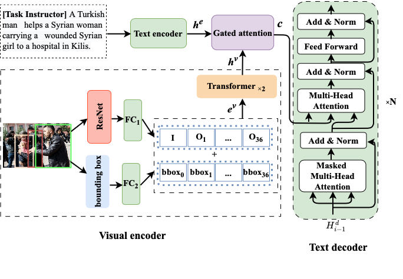
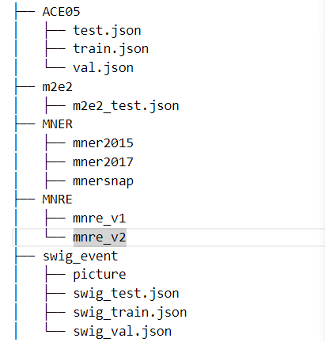

# UMIE (AAAI 2024 Oral)
Code and model for AAAI 2024 (Oral): [UMIE: Unified Multimodal Information Extraction with Instruction Tuning](https://arxiv.org/abs/2401.03082)


# UMIE: Unified Multimodal Information Extraction with Instruction Tuning

## Model Architecture

The overall architecture of our hierarchical modality fusion network.



## Datasets




## Data Download

- Twitter2015 & Twitter2017

  The text data follows the conll format. You can download the Twitter2015 data via this [link](https://drive.google.com/file/d/1qAWrV9IaiBadICFb7mAreXy3llao_teZ/view?usp=sharing) and download the Twitter2017 data via this [link](https://drive.google.com/file/d/1ogfbn-XEYtk9GpUECq1-IwzINnhKGJqy/view?usp=sharing). Please place them in `data/NNER`.
- MNRE
  The MNRE dataset comes from [MEGA](https://github.com/thecharm/MNRE), many thanks.

  MEE
- The MEE dataset comes from [MEE](https://github.com/limanling/m2e2), many thanks.

- SWiG(Visual Event Extraction Data)
We download situation recognition data from SWiG. Please find the preprocessed data in [M2E2](https://github.com/limanling/m2e2/blob/master/src/dataflow/numpy/data_loader_situation.py) and [GSR](https://github.com/allenai/swig).

- ACE05
We preprcoessed ACE following [OneIE](http://blender.cs.illinois.edu/software/oneie/). The sample data format is in sample.json. Due to license reason, the ACE 2005 dataset is only accessible to those with LDC2006T06 license


## Data Preprocess

**Vision**

To extract visual object images, we first use the NLTK parser to extract noun phrases from the text and apply the [visual grouding toolkit](https://github.com/zyang-ur/onestage_grounding) to detect objects. Detailed steps are as follows:

1. Using the NLTK parser (or Spacy, textblob) to extract noun phrases from the text.
2. Applying the [visual grouding toolkit](https://github.com/zyang-ur/onestage_grounding) to detect objects. Taking the twitter2015 dataset as an example, the extracted objects are stored in `twitter2015_images.h5`. The images of the object obey the following naming format: `imgname_pred.png`, where `imgname` is the name of the raw image corresponding to the object, `num` is the number of the object predicted by the toolkit.

The detected objects and the dictionary of the correspondence between the raw images and the objects are available in our data links.


**Text**
We preprcoessed Text data following [uie](https://github.com/universal-ie/UIE/tree/main/dataset_processing)
```bash
bash data_processing/run_data_generation.bash
```

Exapmle:

**Entity**

```json
{
 "text": "@USER Kyrie plays with @USER HTTPURL",
 "label": "person, Kyrie", 
 "image_id": "149.jpg"
}
```

**Relation**

```json
{
	"text": "Do Ryan Reynolds and Blake Lively ever take a bad photo ? 😍",
	"label": "Ryan Reynolds <spot> couple <spot> Blake Lively", 
	"image_id": "O_1311.jpg"
}
```

**Event Trigger**

```json
{
    "text":"Smoke rises over the Syrian city of Kobani , following a US led coalition airstrike, seen from outside Suruc",
    "label": "attack, airstrike",
    "image_id": "VOA_EN_NW_2015.10.21.3017239_4.jpg"
}
```

**Event Argument**

```json
{
    "text":"Smoke rises over the Syrian city of Kobani , following a US led coalition airstrike, seen from outside Suruc",
    "label": "attack <spot> attacker, coalition <spot> Target, O1",
  	"O1": [1, 190, 508, 353],
    "image_id": "VOA_EN_NW_2015.10.21.3017239_4.jpg"
}
```


## Requirements

To run the codes, you need to install the requirements:

```bash
pip install -r requirements.txt
```

## Train

```bash
bash -x scripts/full_finetuning.sh -p 1 --task ie_multitask --model flan-t5 --ports 26754 --epoch 30  --lr 1e-4
```

## Test

```bash
bash -x scripts/test_eval.sh -p 1 --task ie_multitask --model flan-t5 --ports 26768 
```


# Citation
Please kindly cite our paper if you find any data/model in this repository helpful:
```
@inproceedings{Sun2024UMIE,
      title={UMIE: Unified Multimodal Information Extraction with Instruction Tuning}, 
      author={Lin Sun and Kai Zhang and Qingyuan Li and Renze Lou},
      year={2024},
      booktitle={Proceedings of AAAI}
}
```
